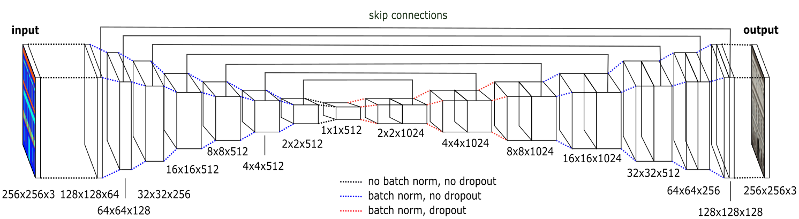
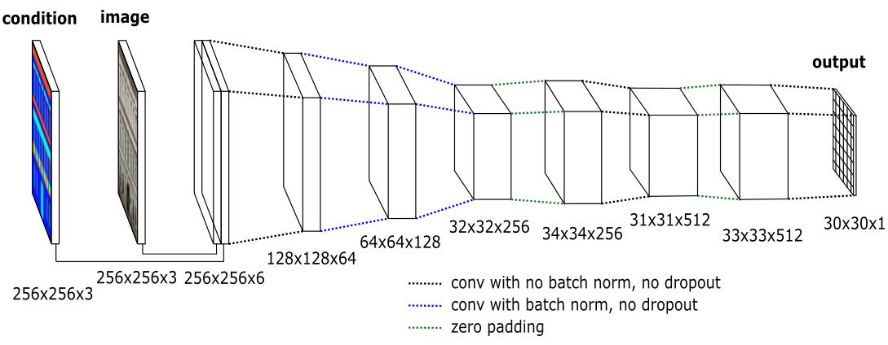
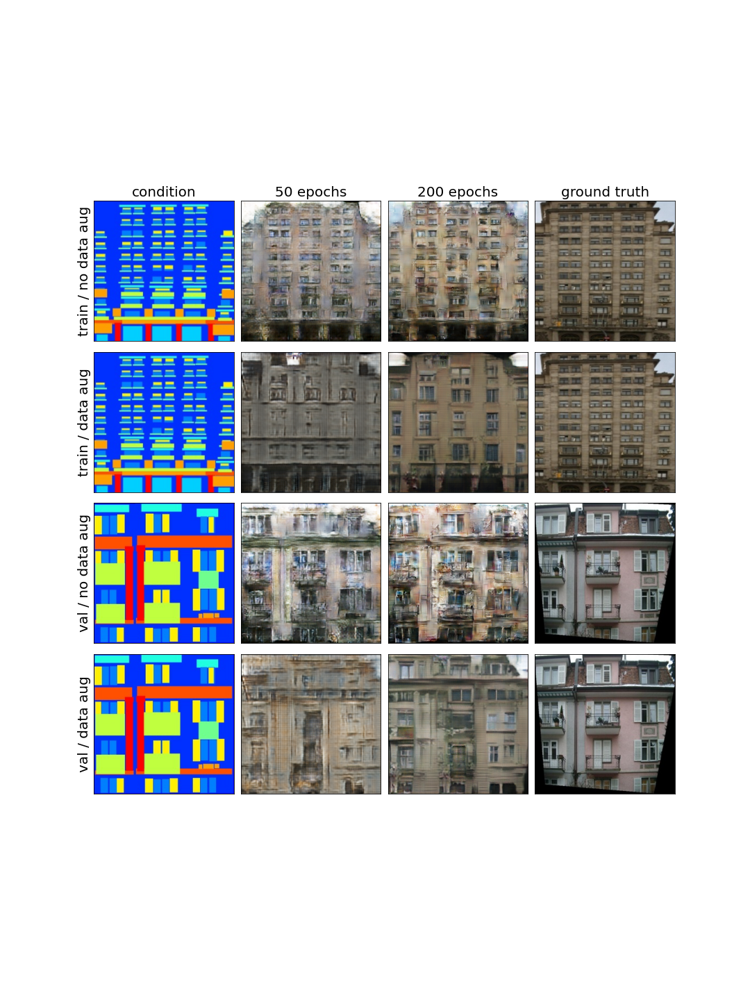
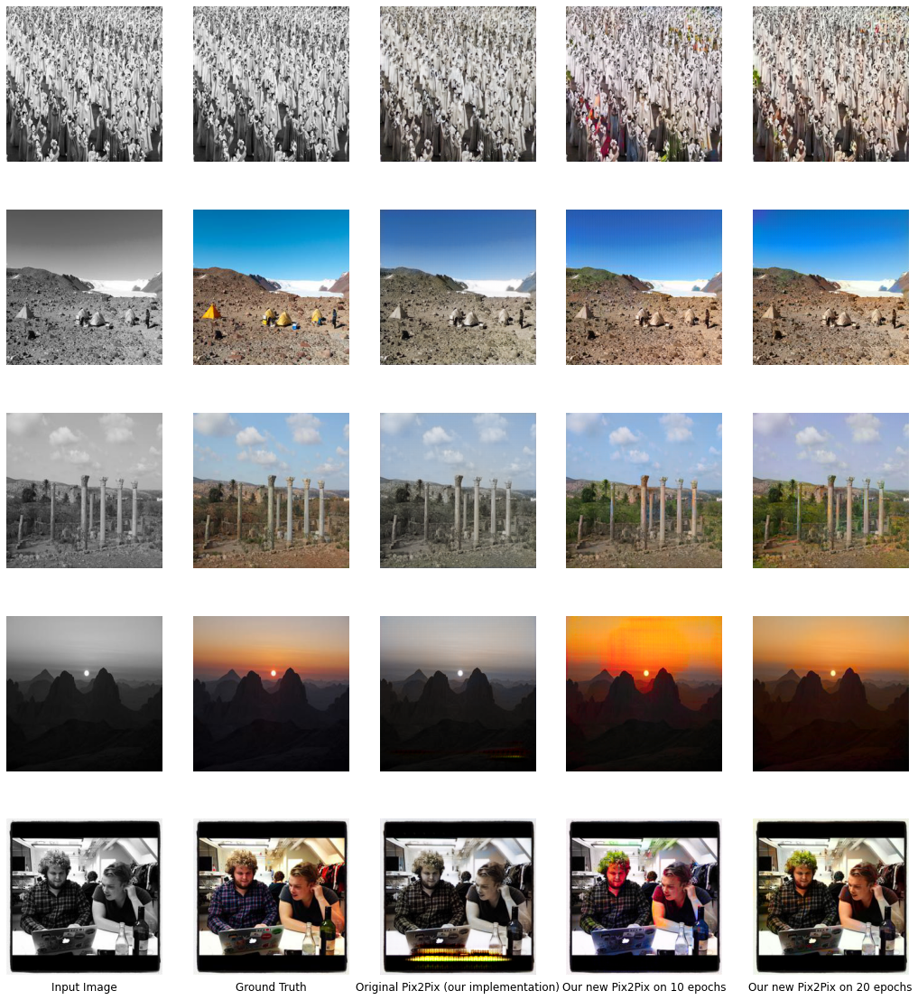

<h1 align="center">Image-to-Image Translation with cGANs </h1> 

<p align="center"> <i>Authors:</i> Waël Boukhobza, Antonin Vidon and Hugo Artigas</p>

<p align="center">
    
  
  <i>From left to right respectively: the greyscale image, the groundtruth image, and our pix2pix recoloring.</i>
</p>

This repo contains our attempt to replicate the results of pix2pix on the 'Facades' dataset. We conduct ablation experiments on data augmentation, choice of loss, batch size, ... We then constitute our own training dataset from [Country211](https://openaipublic.azureedge.net/clip/data/country211.tgz), and perform our colorization task on it. pix2pix by itself actually gives unsatisfactory results for this task; we thus decided to enhance the model by pre-trained the Generator (without the discriminator) on the ImageNet dataset. This results in better results, sometimes indiscernible from a real image with a naked eye.


## Data

### Download pix2pix dataset

```
python download_data.py --dataset_name = 'facades' # download facades dataset
```

## Top-level directory layout

```./
├── figures # architecture diagrams
├── history # training history saved into dictionaries and plots
├── images # data folder
│   └── facades # dataset name
│       |── test
│       |── train
│       └── val
├── plots
├── report
│   └── E6691_2022Spring_ABVZ_report_av3023_ha2605_wab2138.pdf # project report
├── weights
├── ablation_batchsize_facades.ipynb # ablation experiments with batch size on Facades
├── ablation_da_facades.ipynb # ablation experiments with data augmentation on Facades
├── ablation_loss_facades.ipynb # ablation experiments with losses on Facades
├── dataset_colorization_download.ipynb # notebook to download and prepare the Country211 dataset for colorization task
├── download_data.py # script to download pix2pix datasets
├── model.py # our Pix2Pix model implementation
├── train_colorization.ipynb # training notebook for colorization task
├── train_da_facades.ipynb # training notebook with data augmentation on Facades
├── train_noda_facades.ipynb # training notebook without data augmentation on Facades
├── utils.py # all functions used : create dataset, train model, plot, render outputs, ...
├── README.md
└── requirements.txt
```


## Architecture

### Generator



### Discriminator



## Results




## Model weights

[Link to model weights](https://drive.google.com/drive/folders/1x1r_KKVbPvnI8zm7YMAIR6RPV_L4ASt4?usp=sharing) (lionmail only).


## Requirements

See ./requirements.txt
